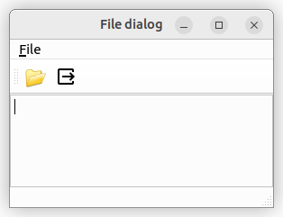

# Pyside6 Deployment Test

This is a Pyside6 test project using Nuitka build for Windows and linux with
Github Actions.



Qt recommends [Nuitka](https://doc.qt.io/qtforpython-6/deployment/deployment-nuitka.html) 
to create Pyside6 executables for Windows and Linux.

## Download executables from Github Actions

Visit [Actions](https://github.com/Erriez/pyside6-nuitka-test/actions), open
a build and download `Linux Build` or `Windows Build` under `Artifacts`.

## Build executable

```bash
# Clone project
$ git clone https://github.com/Erriez/pyside6-nuitka-test.git
$ cd pyside6-nuitka-test

# Install Linux system dependencies
$ sudo apt install ccache clang patchelf

# Create virtual environment
$ virtualenv venv
$ source venv/bin/activate
$ pip install -r requirements.txt
$ pip install nuitka
```

## Build executable on Ubuntu/Mint 22.04/22.10 Desktop

```bash
# Build executable for Linux
$ python3 -m nuitka \
    --output-file=pyside6-app \
    --onefile \
    --enable-plugin=pyside6 \
    --include-data-dir=images=images \
    main.py

# Start created executable
$ ./pyside6-app
```

## Build executable on Windows 10/11 Desktop

```
# Build executable for Windows
$ python3 -m nuitka \
    --output-file=pyside6-app.exe \
    --onefile \
    --enable-plugin=pyside6 \
    --include-data-dir=images=images \
    --disable-console=true \
    --windows-icon-from-ico=images/app.ico \
    main.py
```

