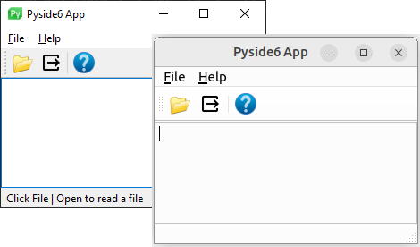

[](https://github.com/Erriez/pyside6-nuitka-deployment/actions/workflows/build.yml)
[](https://github.com/Erriez/pyside6-nuitka-deployment/blob/master/LICENSE)
[](https://github.com/Erriez/pyside6-nuitka-deployment)
[](https://github.com/Erriez/pyside6-nuitka-deployment/issues)

# Pyside6 Deployment Example

This is a Pyside6 example project using Nuitka build for Windows and linux with
Github Actions. Other operating systems are not supported by the developer of
this repository.



Qt recommends [Nuitka](https://doc.qt.io/qtforpython-6/deployment/deployment-nuitka.html) 
or [Pyinstaller](https://pyinstaller.org/en/stable/) to create Pyside6 executables for Windows and Linux.

## Download executables from Github Actions

Visit [Actions](https://github.com/Erriez/pyside6-nuitka-test/actions), open
a build and download `Linux Build` or `Windows Build` under `Artifacts`.

## Build executable manually

```bash
# Clone project
$ git clone https://github.com/Erriez/pyside6-nuitka-deployment.git
$ cd pyside6-nuitka-deployment

# Install Linux system dependencies
$ sudo apt install python3-virtualenv ccache clang patchelf

# Create virtual environment
$ virtualenv venv
$ source venv/bin/activate
$ pip install -r requirements.txt
$ pip install nuitka
```

## Build executable on Ubuntu/Mint 22.04/22.10 Desktop manually

```bash
# Build executable for Linux
$ python3 -m nuitka \
    --output-dir=dist \
    --output-file=pyside6-app \
    --onefile \
    --enable-plugin=pyside6 \
    --include-data-dir=images=images \
    main.py

# Start created executable
$ ./pyside6-app
```

## Build executable on Windows 10/11 Desktop manually

```
# Fix virtualenv issues
> Set-ExecutionPolicy -Scope CurrentUser -ExecutionPolicy Unrestricted

# Build executable for Windows
> python -m nuitka `
    --output-dir=dist `
    --output-file=pyside6-app.exe `
    --onefile `
    --assume-yes-for-downloads `
    --enable-plugin=pyside6 `
    --include-data-dir=images=images `
    --disable-console `
    --windows-icon-from-ico=images/app.ico `
    --company-name="Erriez Open Source Software" `
    --product-name="PySide6 App" `
    --file-version="1.0.0.0" `
    --product-version="`1.0.0.0" `
    --file-description="PySide6 Example App" `
    --copyright="MIT (c) 2023 by Erriez" `
    main.py

# Start created executable
> dist\pyside6-app.exe
```

## Build Windows executable with pyinstaller manually
```
# https://pypi.org/project/pyinstaller-versionfile/
> pip install pyinstaller pyinstaller-versionfile
> create-version-file --outfile version_info.txt version_info.yaml
> pyinstaller `
    --distpath dist `
    --name pyside6-app-pyinstaller.exe `
    --noconfirm `
    --onefile `
    --noconsole `
    --ico images\app.ico `
    --add-data "images;images" `
    --version-file version_info.txt `
    main.py
```

## Build Windows MSI manually
- Download [NSIS v3](https://nsis.sourceforge.io/Download)
- Download [NSIS Quick Setup Script Generator](https://nsis.sourceforge.io/NSIS_Quick_Setup_Script_Generator)
- Start `NSIS Quick Setup Script Generator.exe` and fill-in the wizard.
- Copy generated file from `Output\App\*.nsi` to install.nsi and change to
- relative path / customize.

## False positives virusscanners

Windows Defender and virusscanners such as https://www.virustotal.com/ shows
false positives when building executable with Pyinstaller or Nuitka. This is a
known issue.

## MIT License

This project is published under [MIT license](https://github.com/Erriez/pyside6-nuitka-deployment/blob/master/LICENSE)
with an additional end user agreement (next section).

## End User Agreement :ukraine:

End users shall accept the [End User Agreement](https://github.com/Erriez/pyside6-nuitka-deployment/blob/master/END_USER_AGREEMENT.md)
holding export restrictions to Russia to stop the WAR before using this project.
